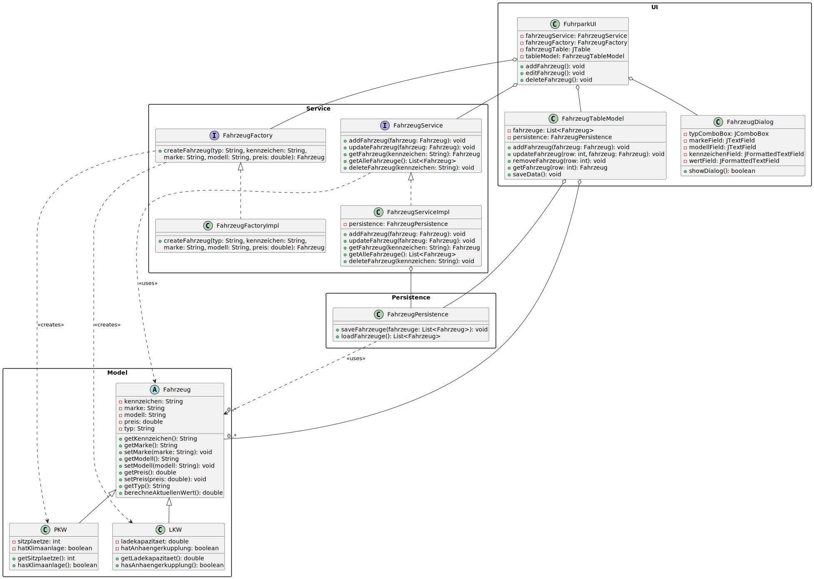

# Benutzerhandbuch: Fuhrpark-Verwaltungssystem

## Einführung

Die Fuhrpark-Verwaltung ist eine professionelle Softwarelösung, die für die effiziente Verwaltung eines Fahrzeugbestands entwickelt wurde. Diese Java-basierte Anwendung ermöglicht es Unternehmen und Organisationen, ihren Fuhrpark systematisch zu erfassen und zu verwalten. Das System wurde unter Berücksichtigung moderner Softwareentwicklungsprinzipien entwickelt und bietet eine intuitive grafische Benutzeroberfläche.

## Systemarchitektur

Das System basiert auf einer mehrschichtigen Architektur, die eine klare Trennung von Verantwortlichkeiten gewährleistet. Das folgende Klassendiagramm visualisiert die Struktur und Beziehungen der verschiedenen Komponenten:



## Detaillierte Systembeschreibung

### Die Modellschicht

Die Modellschicht bildet das Herzstück der Anwendung und implementiert die grundlegende Geschäftslogik des Fuhrpark-Verwaltungssystems. Im Zentrum steht die abstrakte Klasse "Fahrzeug", die als Basisklasse für alle Fahrzeugtypen dient. Diese Klasse definiert die fundamentalen Eigenschaften und Verhaltensweisen, die allen Fahrzeugen gemeinsam sind.

Die Fahrzeug-Klasse verfügt über mehrere wichtige Attribute:
- Das Kennzeichen ist als unveränderliche (finale) Eigenschaft implementiert, da es als eindeutiger Identifikator eines Fahrzeugs dient.
- Die Marke und das Modell sind als veränderliche Eigenschaften angelegt, um mögliche Korrekturen zu ermöglichen.
- Der Preis wird als Gleitkommazahl gespeichert und kann ebenfalls angepasst werden.
- Der Fahrzeugtyp ist wie das Kennzeichen unveränderlich und wird bei der Erstellung festgelegt.

Von der Basisklasse Fahrzeug werden zwei spezialisierte Klassen abgeleitet: PKW und LKW. Diese Klassen erweitern die Grundfunktionalität um spezifische Eigenschaften und Verhaltensweisen:

Die PKW-Klasse fügt folgende Eigenschaften hinzu:
- Eine feste Anzahl von Sitzplätzen, die standardmäßig auf 5 gesetzt ist
- Eine Information über das Vorhandensein einer Klimaanlage
- Eine angepasste Implementierung der Werteberechnung, die den spezifischen Wertverlust von PKWs berücksichtigt

Die LKW-Klasse erweitert das Basisfahrzeug um:
- Eine Ladekapazität, die standardmäßig auf 40 Tonnen gesetzt ist
- Eine Information über das Vorhandensein einer Anhängerkupplung
- Eine eigene Implementierung der Werteberechnung, die den typischen Wertverlust von LKWs abbildet

### Die Persistenzschicht

Die Persistenzschicht wird durch die FahrzeugPersistence-Klasse repräsentiert. Diese Klasse ist für die dauerhafte Speicherung aller Fahrzeugdaten verantwortlich. Sie implementiert zwei zentrale Funktionen:

Die Speicherfunktion (saveFahrzeuge) serialisiert die übergebene Liste von Fahrzeugen und schreibt sie in eine Datei im Benutzerverzeichnis. Diese Funktion wird automatisch aufgerufen, wenn Änderungen am Fahrzeugbestand vorgenommen werden.

Die Ladefunktion (loadFahrzeuge) liest beim Programmstart die gespeicherten Daten aus der Datei und deserialisiert sie wieder in Fahrzeugobjekte. Falls keine Datei existiert oder Fehler beim Lesen auftreten, wird eine leere Liste zurückgegeben, um einen reibungslosen Programmstart zu gewährleisten.

### Die Serviceschicht

Die Serviceschicht stellt zentrale Dienste für die Verwaltung von Fahrzeugen bereit. Das wichtigste Element ist die FahrzeugFactory, die nach dem Factory-Pattern implementiert wurde. Diese Factory ist für die Erzeugung neuer Fahrzeuginstanzen zuständig und stellt sicher, dass alle notwendigen Initialisierungen korrekt durchgeführt werden.

Die FahrzeugFactoryImpl-Klasse implementiert das FahrzeugFactory-Interface und enthält die konkrete Logik zur Erzeugung von Fahrzeugen. Sie verwendet einen Switch-Expression, um basierend auf dem übergebenen Typ die entsprechende Fahrzeugklasse zu instanziieren.

### Die Benutzeroberfläche

Die Benutzeroberfläche wurde mit Java Swing implementiert und besteht aus mehreren eng zusammenarbeitenden Komponenten:

Die FuhrparkUI-Klasse bildet das Hauptfenster der Anwendung. Sie enthält:
- Eine Tabelle zur Anzeige aller Fahrzeuge
- Eine Werkzeugleiste mit Schaltflächen für die wichtigsten Aktionen
- Eine moderne und benutzerfreundliche Gestaltung mit Hover-Effekten

Der FahrzeugDialog dient der Eingabe und Bearbeitung von Fahrzeugdaten. Er bietet:
- Formatierte Eingabefelder für alle relevanten Fahrzeugeigenschaften
- Eine umfangreiche Validierung aller Eingaben
- Kontextabhängige Anpassung je nachdem, ob ein neues Fahrzeug angelegt oder ein bestehendes bearbeitet wird

Das FahrzeugTableModel verwaltet die Daten der Fahrzeugtabelle und bietet:
- Automatische Aktualisierung der Anzeige bei Änderungen
- Formatierung der Währungsbeträge gemäß den deutschen Konventionen
- Automatische Speicherung aller Änderungen

## Funktionalitäten im Detail

### Fahrzeuge hinzufügen

Das Hinzufügen eines neuen Fahrzeugs erfolgt über einen mehrstufigen Prozess:

1. Der Benutzer klickt auf die Schaltfläche "Fahrzeug hinzufügen" in der Werkzeugleiste.
2. Es öffnet sich der FahrzeugDialog im Erstellungsmodus.
3. Der Benutzer wählt zunächst den gewünschten Fahrzeugtyp (PKW oder LKW) aus.
4. Anschließend werden folgende Daten eingegeben:
   - Ein Kennzeichen im Format XXX-XX1234, wobei X für Buchstaben und 1234 für Ziffern stehen
   - Die Marke des Fahrzeugs
   - Das Modell des Fahrzeugs
   - Der Anschaffungspreis in Euro (maximal 10 Millionen Euro)
5. Nach Bestätigung mit "OK" wird das neue Fahrzeug erstellt und in der Tabelle angezeigt.

### Fahrzeuge bearbeiten

Die Bearbeitung bestehender Fahrzeuge erfolgt wie folgt:

1. Der Benutzer wählt das zu bearbeitende Fahrzeug in der Tabelle aus.
2. Durch Klick auf "Fahrzeug bearbeiten" öffnet sich der FahrzeugDialog im Bearbeitungsmodus.
3. Die bestehenden Daten werden in den entsprechenden Feldern angezeigt.
4. Der Benutzer kann folgende Eigenschaften ändern:
   - Den Preis des Fahrzeugs
   - Optional: Marke und Modell (falls Korrekturen erforderlich sind)
5. Nach Bestätigung werden die Änderungen gespeichert und die Anzeige aktualisiert.

### Fahrzeuge löschen

Das Löschen von Fahrzeugen ist wie folgt implementiert:

1. Der Benutzer wählt das zu löschende Fahrzeug in der Tabelle aus.
2. Nach Klick auf "Fahrzeug löschen" erscheint eine Sicherheitsabfrage.
3. Bei Bestätigung wird das Fahrzeug aus dem System entfernt.
4. Die Änderung wird automatisch gespeichert und die Tabelle aktualisiert.

## Installation und Systemvoraussetzungen

### Technische Voraussetzungen

Für den Betrieb der Fuhrpark-Verwaltung sind folgende Komponenten erforderlich:

- Ein Computer mit einem aktuellen Betriebssystem (Windows, macOS oder Linux)
- Java Runtime Environment (JRE) in Version 17 oder höher
- Mindestens 256 MB freier Arbeitsspeicher
- Etwa 50 MB freier Festplattenspeicher
- Eine Bildschirmauflösung von mindestens 1024x768 Pixeln

### Installationsanleitung

Die Installation der Anwendung erfolgt in wenigen Schritten:

1. Laden Sie die Anwendung als ZIP-Archiv herunter
2. Entpacken Sie das Archiv in ein beliebiges Verzeichnis
3. Starten Sie die Anwendung durch Doppelklick auf die JAR-Datei oder über die Kommandozeile mit:
   ```bash
   java -jar fuhrpark.jar
   ```

### Entwicklungsumgebung

Für Entwickler steht das Projekt als Maven-Projekt zur Verfügung. Die Einrichtung in Eclipse erfolgt wie folgt:

1. Importieren Sie das Projekt als Maven-Projekt
2. Führen Sie `mvn clean install` aus, um alle Abhängigkeiten zu laden
3. Starten Sie die Anwendung über die App.java-Klasse

## Technische Details

### Datenvalidierung

Das System implementiert umfangreiche Validierungen:

- Kennzeichen müssen dem Format XXX-XX1234 entsprechen, wobei X für Buchstaben und 1234 für Ziffern stehen
- Der Preis ist auf maximal 10 Millionen Euro begrenzt
- Alle Pflichtfelder müssen ausgefüllt sein
- Duplikate bei Kennzeichen werden verhindert

### Datenspeicherung

Die Datenspeicherung erfolgt automatisch und transparent:

- Alle Änderungen werden sofort in einer Datei im Benutzerverzeichnis gespeichert
- Beim Programmstart werden die gespeicherten Daten automatisch geladen
- Bei Fehlern während des Speicherns oder Ladens werden entsprechende Fehlermeldungen angezeigt

## Lizenz und rechtliche Hinweise

Die Fuhrpark-Verwaltung steht unter der MIT-Lizenz. Dies bedeutet:

- Die Software darf frei verwendet, kopiert und modifiziert werden
- Die Verwendung in kommerziellen Projekten ist erlaubt
- Der Original-Copyright-Vermerk muss erhalten bleiben
- Es wird keine Garantie für die Funktionsfähigkeit übernommen

Detaillierte Lizenzinformationen finden Sie in der LICENSE-Datei im Projektverzeichnis.

